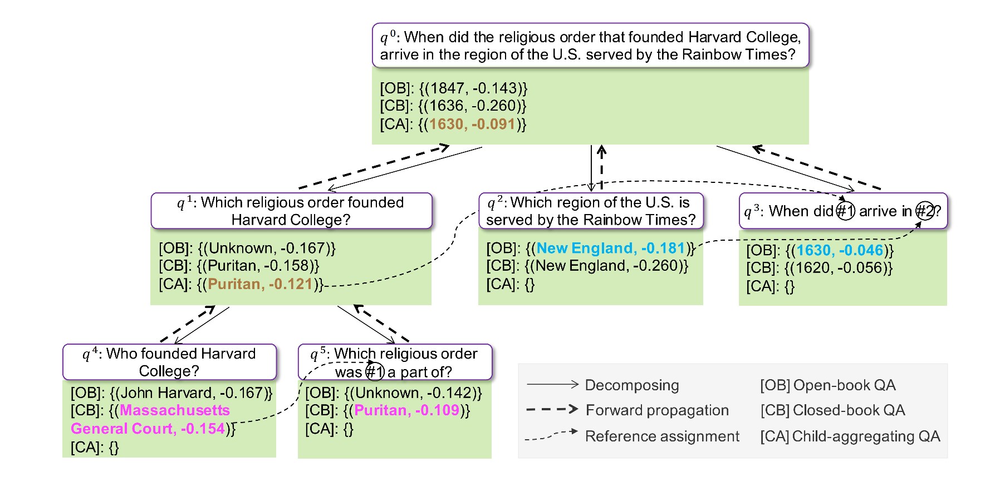

# ProbTree
Source code for findings of EMNLP 2023 paper "Probabilistic Tree-of-thought Reasoning for Answering Knowledge-intensive Complex Questions".

[](https://github.com/Neo-Zhangjiajie/ProbTree/issues)
[](https://opensource.org/licenses/Apache-2.0)
[](https://www.python.org/)
[](https://arxiv.org/abs/2212.09736)

> In this paper, we propose a novel approach: Probabilistic Tree-of-thought Reasoning (ProbTree). First, LLMs translate a complex question into a query tree, in which each non-root node denotes a sub-question of its parent node. Then, probabilistic reasoning is conducted over the tree, by solving questions from leaf to root considering the confidence of both question decomposing and answering. During reasoning, for leaf nodes, LLMs choose a more confident answer from Closed-book QA that employs parametric knowledge and Open-book QA that employs retrieved external knowledge, thus eliminating the negative retrieval problem. For non-leaf nodes, with the hierarchical structure, LLMs have broader sights and are able to globally reason with the information from child nodes, thus recovering from local errors. The experiments on three Complex QA datasets under the open-domain setting show that our approach outperforms SOTA methods significantly, demonstrating the effect of probabilistic tree-of-thought reasoning.

<div  align="center"> 

</div>

## File Structure
```
ProbTree/
├─  data/: 
│    ├─  2wiki: original 2WikiMQA dataset
│    ├─  musique: original MuSiQue dataset
│    └── enwiki-20171001-pages-meta-current-withlinks-abstracts: Wikipedia dump for HotpotQA
├─  released_data/: released test samples by IRCoT
├─  src/:
│    ├─  2wiki: experiment codes for 2WikiMQA
│        ├─  RoHT: code for probablisitc reasoning
│        ├─  Tree_Generation: code for generating quesion decomposition trees
│        ├─  0_generate_tree.sh: script for probablisitc reasoning
│        └── 1_conduct_reasoning.sh: script for generating quesion decomposition trees
│    ├─  hotpotqa: experiment codes for HotpotQA
│    ├─  musique: experiment codes for MuSiQue
│    └── service: 
│        ├─  es: Elasticsearch services
│        └── openai: OpenAI Service
└──  download_hotpotqa_wikipedia.sh: scripts for downloading Wikipedia dump for HotpotQA
```

## Download Data
1. Download the original [2WikiMQA](https://github.com/Alab-NII/2wikimultihop) and [MuSiQue-ans](https://github.com/stonybrooknlp/musique) datasets, then put their train, dev and test sets under `./data/2wiki` and `./data/musique`, respectively. 

2. Download the Wikipedia dump for [HotpotQA](https://hotpotqa.github.io/) and put it under `./data`:
```
bash download_hotpotqa_wikipedia.sh
```

3. Download the [released test samples](https://drive.google.com/drive/folders/1UAlz8NIwTSR2CVXlWlKWh-oadjCAtJfA?usp=sharing) by [IRCoT](https://github.com/StonyBrookNLP/ircot/tree/main) and put them under `./released_data`.

## Prepare Services

### 1. Elasticsearch
Install Elasticsearch following [official document](https://www.elastic.co/guide/en/elasticsearch/reference/current/targz.html) to enable BM25 retrieval. We use the version 8.1.2.

Run Elasticsearch with a tmux window:
```
cd elasticsearch-8.1.2/bin # replace this with your installation path
./elasticsearch
```

Index corpus and BM25 retriever for 2WikiMQA, MuSiQue, and HotpotQA with tmux windows:
```
cd src/service/es

# 2WikiMQA
python index_2wiki_wiki.py
python run_2wiki_index.py

# MuSiQue
python index_musique_wiki.py
python run_musique_index.py

#HotpotQA
python index_hotpotqa_wiki.py
python run_hotpotqa_index.py
```


### 2. OpenAI Service
Put your OpenAI keys in `src/openai/openai_service.py`, then run OpenAI service with a tmux window:
```
cd src/service/openai
python openai_service.py
```

### 3. Google Search API
Put your Serp API key in `src/hotpotqa/RoHT/question_answering.py` so that you can use Google Search API.

## Run Experirments
First generate question decompostion trees, then conduct probablistic reasoning on these trees.
```
cd src/{dataset_name} # 2wiki, musique, hotpotqa
bash 0_generate_tree.sh
bash 1_conduct_reasoning.sh
```

We have released our generated question decompostion trees so that you can directly run probablistic reasoning.
```
src/{dataset_name}/Tree_Generation/tree.json # 2wiki, musique, hotpotqa
```

We also released our prediction results corresponding to the reported scores in
```
src/{dataset_name}/RoHT/results/released.json # 2wiki, musique, hotpotqa
```
